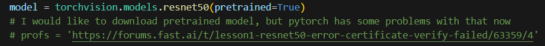
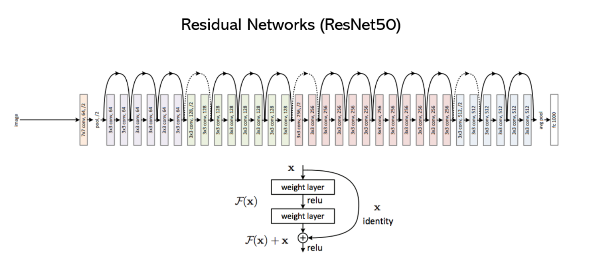
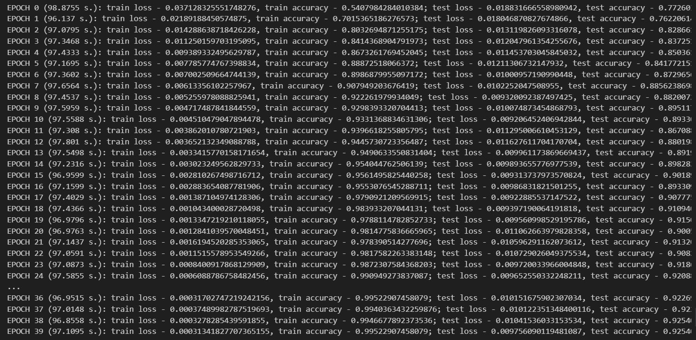

# PAK_project
<h1>Flowers classification project</h1>
<h2>1. Введение</h2>

Цель раюоты - создать модель для классификации цветов. Датасет был взят с kagle, модель обучалась на этом же сайте. 
Согласно условиям соревнования требовалось создать файл с предсказаниями моделей в формате .csv и отправить его. 

<h2>2. Выполнение задания</2>

Для выполнения задания мыла выбранна модель ResNet50.

Общая архитектура модели Resnet

В своей программе, для обучение модели, я использовал оптимайзер Адам, функцию потерь CrossEntropy, а так же sheduler, для того, чтобы коррективовать learning rate. Информацию по последнему я взял по <a href="https://neptune.ai/blog/how-to-choose-a-learning-rate-scheduler">этой ссылке</a>

<h2>3. Процесс обучения</h2>
<h4>Accuracy in training loop</h4>

